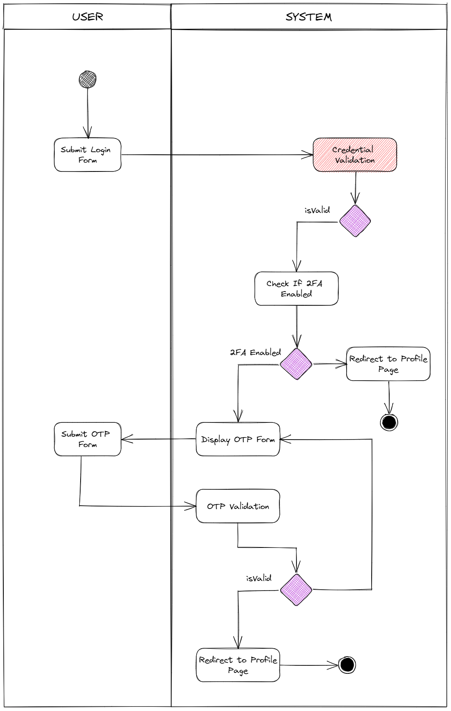
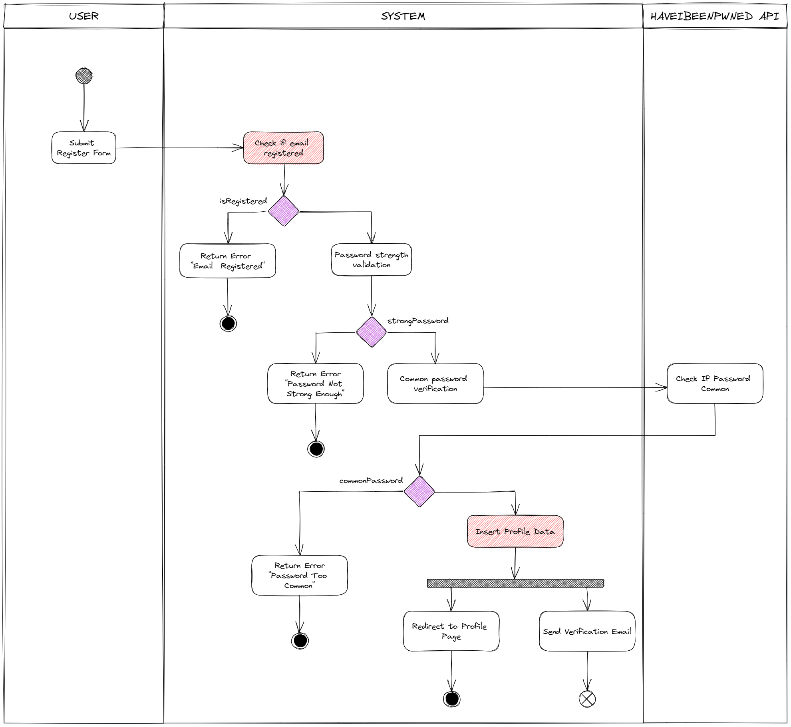

# Authentication App

This is a simple authentication app built with the [T3 Stack](https://create.t3.gg/).

## Live Demo

https://auth.drith.me

## Features

- Credential Sign In
- Sign in with third-party providers (Google, Twitter, GitHub)
- Email verification
- Two-factor authentication with TOTP
- Common password validation
- Google reCAPTCHA v3
- Api Rate Limiting

## Activity Diagram

### Sign In

### Sign Up

